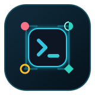
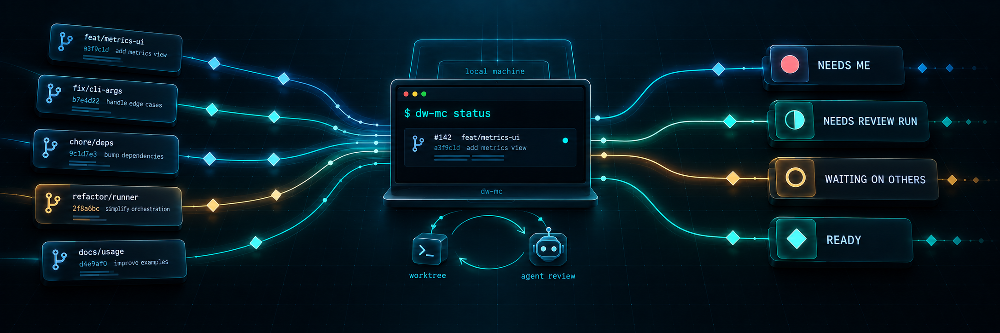

<p align="center">
  
</p>

<h1 align="center">dw-mc</h1>

<p align="center"><strong>A local CLI for keeping track of your open pull requests.</strong></p>

<p align="center">
  <a href="https://www.npmjs.com/package/dw-mc"></a>
  <a href="https://github.com/dominikwozniak/dw-mc/actions/workflows/quality-gate.yaml"></a>
  <a href="./LICENSE"></a>
  <a href="https://nodejs.org"></a>
</p>



`dw-mc` tracks open pull requests you authored. It reads GitHub through your authenticated `gh`, runs code reviews with Claude Code, and puts each pull request in exactly one bucket. It has no server, GitHub App or webhooks.

- **One bucket per pull request** — _Needs me_, _Needs review run_, _Waiting on others_ or _Ready_.
- **Local code reviews** — use `/code-review`, your own instructions or both.
- **Plain-file state** — configuration, records and review reports live under XDG paths.
- **Picker and commands** — the picker runs the same commands you can run directly.

## Example

```
$ dw-mc status

Needs me
  ↳ dominikwozniak/dw-mc#71 from Needs review run: 0 → 2 blocking findings
* ● dominikwozniak/dw-mc#71   │ feat(sweep): notice a head that moved under a run   │ 2 blocking findings

Needs review run
  ◐ dominikwozniak/dw-mc#65   │ docs(agents): how a change becomes a release        │ no review run on this head
  ◐ dominikwozniak/dw-mc#66   │ docs(skill): the CLI surface the skill actually has │ no review run on this head

Waiting on others
+ ○ dominikwozniak/dw-mc#68   │ fix(rebase): keep the lease on a head that moved    │ CI is still running

Ready
  ◆ dominikwozniak/dw-mc#62 ✓ │ feat(comments): read a pull request's threads       │ approved, green, mergeable
```

## Install

```sh
pnpm add -g dw-mc
```

To try it without installing:

```sh
pnpm dlx dw-mc --help
```

### Requirements

- Node 24 or newer
- [`gh`](https://cli.github.com), authenticated: `gh auth login`
- `git`
- [Claude Code](https://claude.com/claude-code) available as `claude`

## Quick start

```sh
dw-mc init      # set up dw-mc and register the current repository
dw-mc           # open the picker
dw-mc review 62 # review a pull request directly
```

`dw-mc init` is noninteractive. On its first run it creates the default configuration, then registers the repository you are in. Review behaviour is controlled by `review.command` and `review.prompt`.

Commands accept a pull request as `62` inside its repository or as `owner/name#62` from anywhere.

## Commands

| Command               | What it does                                                                           |
| --------------------- | -------------------------------------------------------------------------------------- |
| `dw-mc`               | Opens the picker with every tracked PR and its available actions.                      |
| `dw-mc init`          | Sets up this machine and registers the current repository.                             |
| `dw-mc sweep`         | Reads GitHub and updates the local record for every tracked PR.                        |
| `dw-mc status`        | Shows each tracked PR's bucket, stamp and changes since it was last shown.             |
| `dw-mc comments <pr>` | Prints the conversation or records your acknowledgement.                               |
| `dw-mc review <pr>`   | Reviews a pull request with Claude Code in a throwaway worktree.                       |
| `dw-mc findings <pr>` | Prints the findings from the current review run.                                       |
| `dw-mc fix <pr>`      | Opens a fix session for selected findings.                                             |
| `dw-mc stamp <pr>`    | Prints or withdraws your local stamp.                                                  |
| `dw-mc rebase <pr>`   | Rebases a branch onto its base and pushes it with a lease.                             |
| `dw-mc resolve <pr>`  | Opens a resolve session for a conflicted rebase.                                       |
| `dw-mc rerun <pr>`    | Runs a flaky failure again, once per head.                                             |
| `dw-mc merge <pr>`    | Squash-merges a Ready, stamped pull request, deletes its branch and forgets it.        |
| `dw-mc forget <pr>`   | Forgets a pull request that closed another way.                                        |
| `dw-mc cleanup`       | Removes clones and completed review worktrees while keeping configuration and records. |
| `dw-mc uninstall`     | Removes the state written by `dw-mc` and explains how to remove the binary.            |

Run `dw-mc <command> --help` for command options.

## How it works

Each tracked PR is in exactly one **bucket**, named for what it waits on. Bucket rules run in order and the first match wins. For example, a pull request with changes requested goes to Needs me even if it also needs a review run.

| Bucket            | Marker | It waits on                                                                             |
| ----------------- | ------ | --------------------------------------------------------------------------------------- |
| Needs me          | `●`    | You: blocking findings, changes requested, a conflict, a red CI, an unanswered comment. |
| Needs review run  | `◐`    | A review run on this head.                                                              |
| Waiting on others | `○`    | A reviewer who has not answered, or CI that is still running.                           |
| Ready             | `◆`    | Nothing.                                                                                |

A **stamp** is your local mark that a pull request has passed your bar. It is not a GitHub approval, but `dw-mc merge` requires it.

A review run uses a throwaway worktree. A fix or resolve session leaves its worktree in place because the changes in it are yours.

Every other word this tool uses is defined in [`CONTEXT.md`](./CONTEXT.md), and the decisions behind them in [`docs/adr/`](./docs/adr).

## Configuration

- Configuration: `$XDG_CONFIG_HOME/dw-mc/config.yaml`, or `~/.config/dw-mc/config.yaml`
- State, including the worktrees: `$XDG_STATE_HOME/dw-mc`, or `~/.local/state/dw-mc`

`dw-mc init` writes the configuration file. Every key is optional, and entries under `repos` override `defaults` using the same shape.

```yaml
launcher:
  command: [claude] # program + argument prefix that starts Claude Code
  fix_args: [] # flags only a fix session gets
defaults:
  base: null # the default branch from gh when null
  review:
    command: /code-review # the slash command a run opens on; null for none
    effort: low # the word after the command: low | medium | high | xhigh | max
    prompt: null # your own review brief
    model: null
    docs_only: ["**/*.md", "docs/**"]
  ci:
    ignore: [] # check names that do not count towards green
    flaky_patterns: []
  fix:
    commits: false # whether a fix session may commit; --commit overrides it
  rebase:
    enabled: false
  stamp:
    blocks_on: error
repos:
  owner/name:
    # the same keys, overriding defaults
```

## Uninstall

A package manager removes only the binary. Use the commands below to remove state created by `dw-mc`:

```sh
dw-mc cleanup   # remove clones and completed review worktrees
dw-mc uninstall # remove dw-mc state
pnpm remove -g dw-mc
```

- `cleanup` keeps configuration and records. It never removes a fix or resolve worktree, or the clone that worktree uses.
- `uninstall` keeps the configuration file unless you pass `--config`. It refuses to remove a fix or resolve worktree with uncommitted changes or commits missing from the pull request's head unless you also pass `--force`.
- Both commands show what they will remove and ask for confirmation. Pass `--yes` when no terminal is available.

## Agent skill

Install the bundled `/dw-mc` skill to let an agent session read mission control through the CLI:

```sh
pnpm dlx skills@latest add dominikwozniak/dw-mc
```

## Contributing

```sh
pnpm install
pnpm check # lint, format, typecheck, test, build — the whole gate, and what CI runs
```

See [`CONTRIBUTING.md`](./CONTRIBUTING.md) for the development workflow, source layout and changeset policy. Contributions follow the [Code of Conduct](./CODE_OF_CONDUCT.md).

Found a security issue? Do not open an issue — [`SECURITY.md`](./SECURITY.md) says how to report it privately.

## License

MIT. Third-party notices are in [`NOTICE.md`](./NOTICE.md).
